# Field Notes

**A private offline journal and safety companion for psychedelic and other substance experiences.**

Field Notes is a journal that understands what a session is. Write plain diary
entries or log an experience as it happens — what you took, how much, and how
you're feeling over time. Before you combine substances, check them against a
built-in reference of known dangerous combinations. During a session, a calm
AI companion is there to talk — it runs entirely on your machine, so the
conversation never leaves the room.

There are no accounts, no cloud, and no network requests. Your journal can be
encrypted with a password, and nothing you write is ever scanned, analyzed, or
sent anywhere. It works on **Windows, macOS, and Linux**, with optional access
from your phone.

> ⚠️ **Harm-reduction and journaling tool — not medical advice, and not
> encouragement to use anything.** Dose and interaction information is a reference
> and safety backstop only: incomplete, possibly wrong, and no substitute for a
> qualified clinician. The interaction checker flags only some well-known dangerous
> combinations — **absence of a warning does not mean a combination is safe.** In
> an emergency, contact local emergency services or poison control.

## Features

- **Journal** — log experiences with intention, set & setting, doses, and a
  running timeline of how you feel. Edit, delete, or backdate anything. Logging
  something that already happened is a first-class option — tick "this already
  happened" on a new session and it's saved as a finished trip, with doses
  defaulting to when it occurred rather than now. Every timestamp in a session
  also shows the time since your first dose (`14:02 (t+1:23)`), so the timeline
  reads against the clock that matters. A session you never got round to titling
  takes the name of the first substance you log into it, so nothing sits in the
  journal as "Untitled" — rename it whenever you like.
- **Plain notes** — not everything is a session. Write ordinary journal entries
  (a title, your words, a date) alongside them.
- **Combination warnings** — every dose is checked against the others for
  well-documented dangerous combinations, and there's a standalone checker to
  consult *before* taking anything.
- **Dose reference** — dose ranges, durations, and graded interaction data for
  hundreds of substances, bundled with the app and available offline. Search the
  reference prose, or read any of the 575 substance entries **in full** —
  pharmacology, harm potential, tolerance, legality — with the exact dose figures
  alongside. Sourced from [DoseWiki](https://dose.wiki) (public domain).
- **Companion** — a calm, non-judgmental support chat that runs on a local AI
  model. It can be aware of your current session, look up references, and log
  things for you when you ask. Pick a support style ("just listen", "keep me
  grounded", …) and it honors it. It loads in the background so the window never
  freezes while it thinks, and it tells you up front if your machine is short on
  memory to run the model. It's improving but still rough in places — see
  [Companion quality](#companion-quality). You can also turn it off entirely and
  use everything else.
- **Quick dose log** — most of what gets recorded isn't a trip you sit through and
  write up, it's "I took this, at about this time". **+ Dose** on the desktop, or
  the top of the phone's Now screen, takes a substance, an amount and a time —
  recent substances and times like "last night" are one tap — and leaves a real
  entry in the journal. Add the notes, rating and any other doses later, from
  either screen, or don't.
- **Live session** — a quiet, altered-state-friendly screen for an ongoing
  experience: elapsed time, one-tap logging, the companion, and an always-visible
  **Get help now** button. Timeline notes can be edited after the fact — on the
  desktop and from the phone.
- **Crisis resources** — if a chat with the Companion shows signs of crisis, or a
  dangerous combination is logged, real emergency and peer-support contacts
  appear. This is driven by fixed rules, never by the AI — and your journal
  writing is never scanned.
- **Import from text** — paste a past experience in any form, from a one-line note
  to a full trip report with T+ timestamps, and the local model pulls out the
  substances, doses, and timeline into a structured entry you review before saving.
- **Reference search** — search thousands of passages of substance information
  (pharmacology, tolerance, legality) offline.
- **Encryption & backups** — optional password encryption for the whole journal,
  plus one-file backup and restore.
- **Obsidian sync** — export entries to an Obsidian vault as readable Markdown
  notes and import them back; works both ways, fully offline. Any single entry
  can also be exported on its own ("Export this entry" on the desktop, "Export"
  on the phone) in the same format, so it drops straight into a vault.
- **Phone access** (optional, off by default) — pair your phone and use the
  journal, combo checker, reference, and Companion from bed at 3am. The desktop
  shows a green **"Paired successfully"** light the moment the phone first uses
  the code, so you're not left guessing whether the scan took. Companion
  replies run as a background job on the desktop, so a slow local model — or a
  locked phone screen — no longer drops the answer. Starting a session from the
  phone takes an optional title — or leave it blank and the first substance you
  log names it. Or skip the session entirely: **log something you took** —
  substance, amount, and when — as a one-shot entry, for any day you're catching
  up on. Past entries are editable from the phone too: tap any dose or note to
  correct it, add one you forgot, or open the entry to change its title, times,
  rating and write-up. Private by design: see
  [Architecture](#architecture) for how.
- **Substance catalogue & log** — keep your own substance list with notes, and
  review your history grouped by substance.
- **Contribute upstream** (consent-gated) — export substances you've catalogued
  that DoseWiki doesn't cover as a draft to submit by hand. Never automatic,
  never includes journal data.
- **Send feedback** — a link in Settings opens a prefilled bug report or feature
  request on GitHub, in your browser. Nothing is sent from the app itself.

## Screenshots

| | |
|:---:|:---:|
| 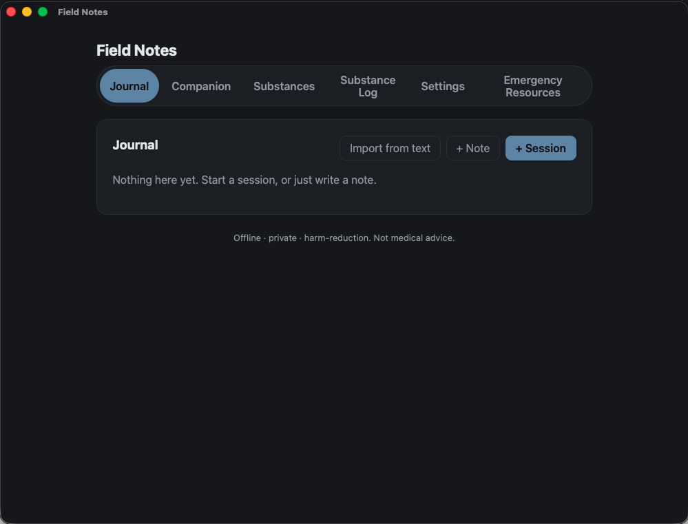 | 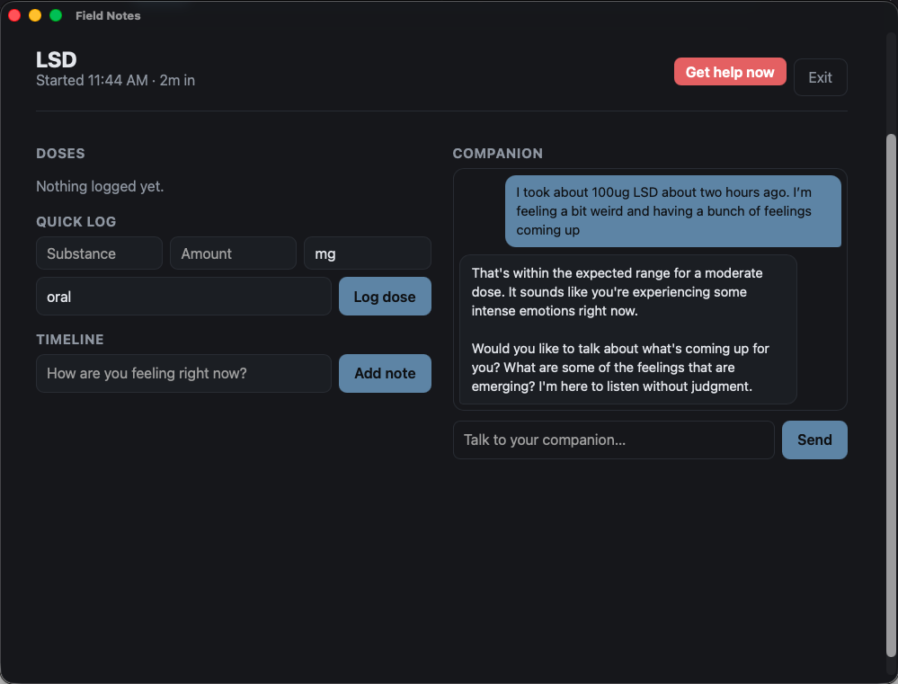 |
| **Journal** — sessions and plain notes in one place | **Live session** — elapsed time, one-tap logging, and the companion |
| 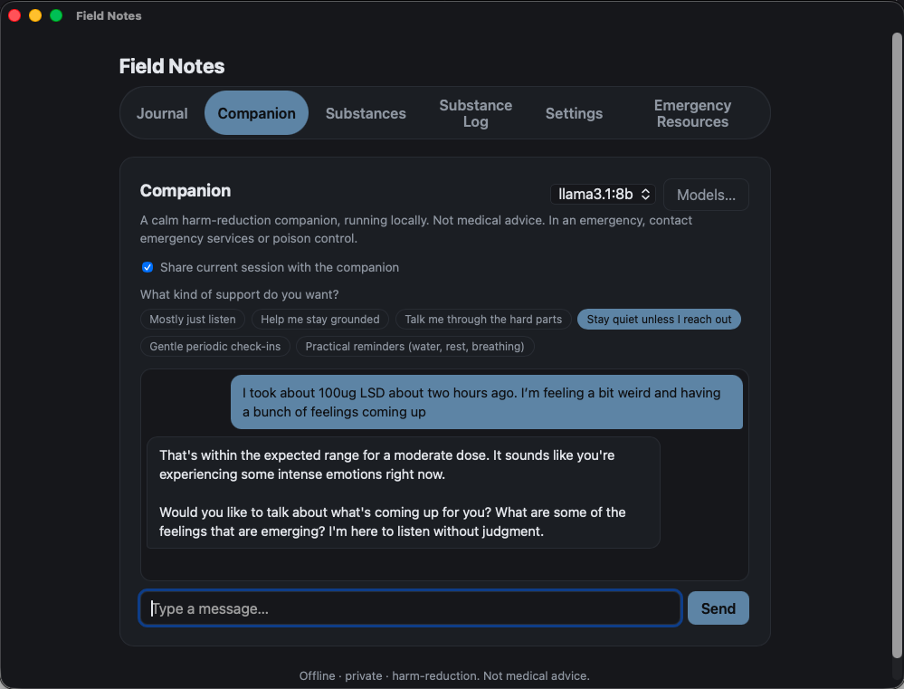 | 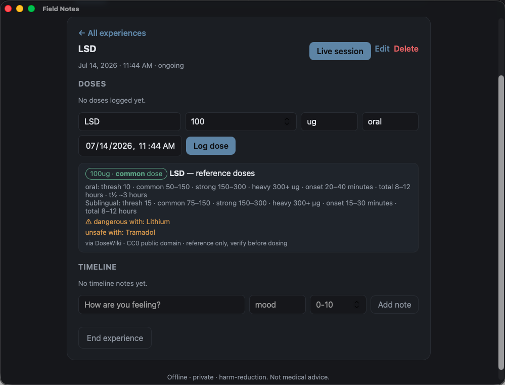 |
| **Companion** — local AI support chat with selectable support styles | **Session detail** — doses with inline reference ranges and combination warnings |
| 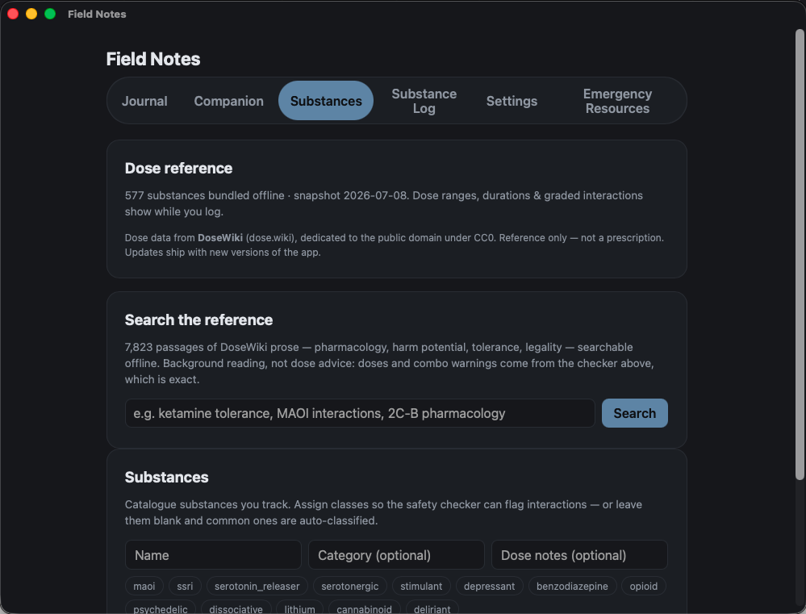 | 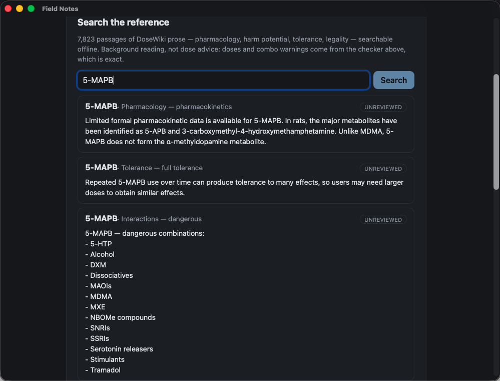 |
| **Substances** — offline dose reference and your own catalogue | **Reference search** — thousands of DoseWiki passages, searchable offline |
| 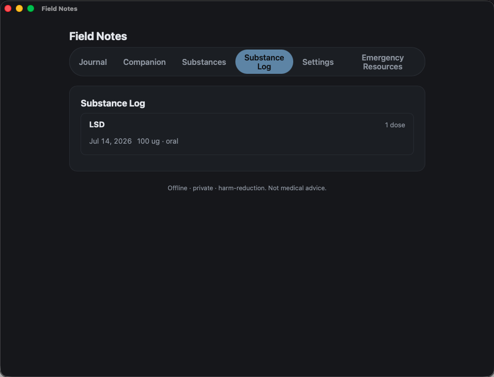 | 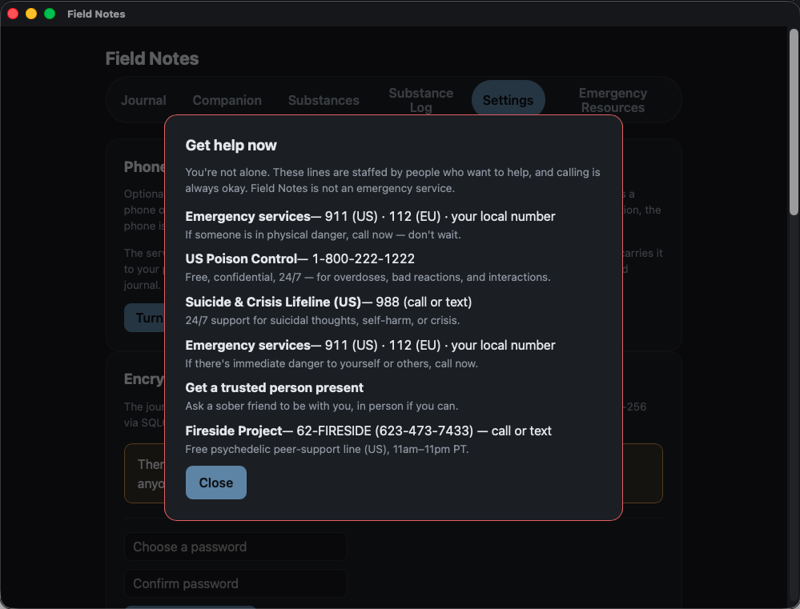 |
| **Substance log** — history grouped by substance | **Get help now** — real crisis and peer-support contacts, always one tap away |
| 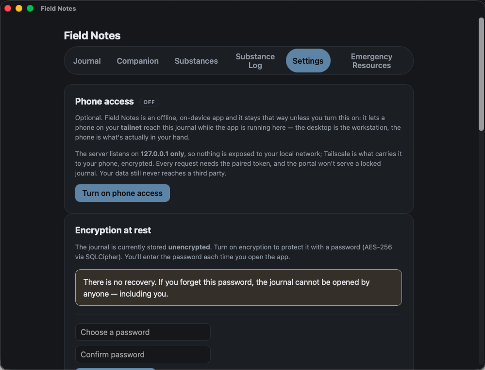 | 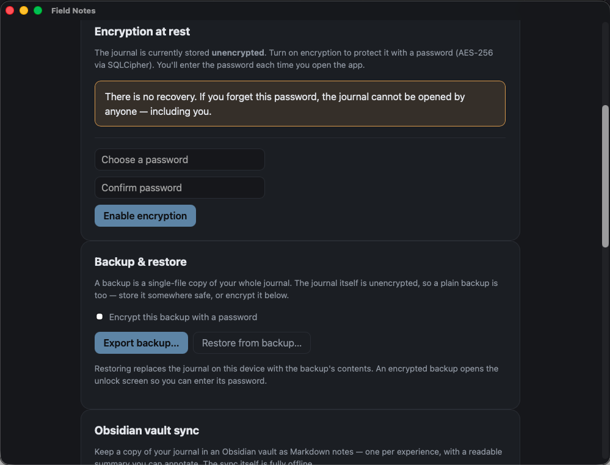 |
| **Phone access** — optional, Tailscale-only, off by default | **Encryption & backups** — AES-256 at rest, one-file backup and restore |
| 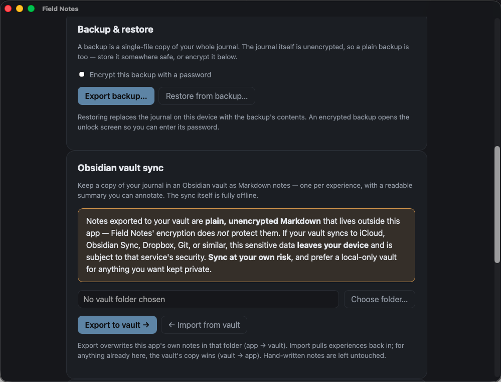 | 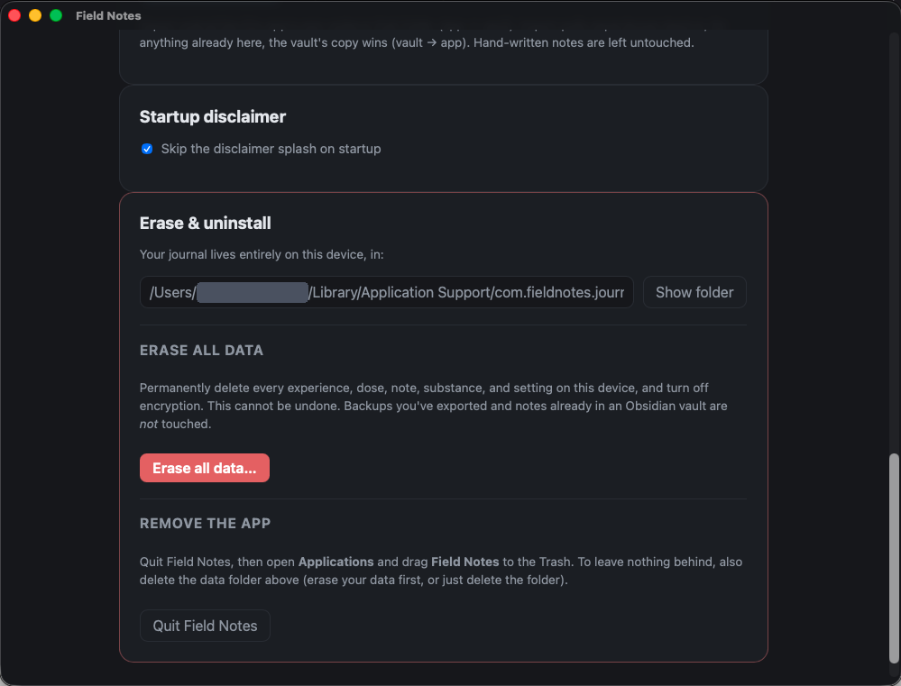 |
| **Obsidian sync** — two-way Markdown export, fully offline | **Your data, one folder** — everything lives on your device, erase anytime |

## Install & update

Download an installer for your platform from the
[Releases page](https://github.com/sparkly-quasar/field-notes/releases):

- **Windows** — run the `-setup.exe` installer (or the `.msi`). Not code-signed yet,
  so SmartScreen may warn on first launch — click **More info → Run anyway**.
- **macOS** — open the `.dmg`, drag Field Notes to Applications. Not notarized yet,
  so on first launch **right-click → Open** (or `xattr -dr com.apple.quarantine
  "/Applications/Field Notes.app"`).
- **Linux** — the `.AppImage` (make it executable and run), or the `.deb` / `.rpm`.

**To update:** the app checks for updates on launch and installs them in place
("Install & restart") — signed and verified, fully in-app. You can also install
any release over the old version by hand. **Your journal is safe either way** —
all data lives in the OS app-data directory
(`%APPDATA%\com.fieldnotes.journal` on Windows,
`~/Library/Application Support/com.fieldnotes.journal` on macOS,
`~/.local/share/com.fieldnotes.journal` on Linux), separate from the app itself,
so updating never touches it.

## Architecture

- **Tauri 2 + Svelte (TypeScript)** desktop app (Windows + macOS + Linux), built
  on the same stack as [Cairn](https://github.com/sparkly-quasar/cairn).
- **Local SQLite** (`rusqlite`, bundled) at the app data dir — `substances`,
  `experiences` (sessions *and* plain notes, split by an explicit `kind` column),
  `doses`, `timeline_events`. No network, no accounts. Opt-in **SQLCipher**
  encryption at rest (AES-256).
- The safety-critical layers are **deterministic Rust, independent of any model** —
  `interactions.rs` (interaction rules + class vocabulary, common-knowledge
  harm-reduction categories not derived from any copyrighted source), `crisis.rs`
  (crisis signals in Companion chat + graded resources; journal prose is never
  scanned — owner's decision, recorded in `ROADMAP.md`), `pw.rs` (the dose
  reference; snapshot + slimming pipeline in [`data/dosewiki/`](./data/dosewiki/)).
- `knowledge.rs` — BM25 over the bundled DoseWiki prose corpus (7,800+ passages,
  575 substances), in-process, no embeddings.
- `portal.rs` — the optional phone server. Binds **127.0.0.1 only** and is fronted
  by your **Tailscale tailnet**; every request needs a paired token; it refuses to
  serve a locked journal; and it exposes a strict **allowlist** — wiping the
  journal, the passphrase, backups, and filesystem access are unreachable from a
  phone by construction. Its module docs state four load-bearing rules, and tests
  pin all four.
- `contribute.rs` — upstream draft exports, with no HTTP client in the file at all.
- The AI features (Companion, text import) talk only to a local
  [Ollama](https://ollama.com) instance on `127.0.0.1` — the app can install it
  and download a model for you on first use.

## Companion quality

The Companion is the least finished part of this app, and it's worth being
straight about that. v0.9.0 made real improvements — it no longer invents
durations or cites references it never read, and the default model was changed
to one that will actually engage when things get hard. There's an evaluation
harness (`src-tauri/eval/scenarios.json`, 30 scenarios) so changes are measured
rather than guessed at.

It still has rough edges. It runs long when it should be brief, occasionally
misses a tool call it should have made, and its register drifts from the calm,
non-directive tone it's aiming for. Prompt work to address that is the next
step. Quality also depends on your hardware — a small model on an older machine
will be noticeably worse.

None of this touches the safety-critical layers. The interaction checker, crisis
detection and dose reference are deterministic Rust that run regardless of which
model is loaded, or whether one is loaded at all. If the Companion isn't earning
its keep on your machine, turn it off in Settings; everything else is unaffected.

## Roadmap

- **Companion register** — prompt restructuring and worked examples, so it stays
  brief and non-directive. Measured against the eval harness.
- **Offline capture on the phone** — log while the desktop is asleep or you're off
  the tailnet, with an outbox that syncs when it's reachable again. Gated on
  porting the deterministic safety checks to run phone-side: an offline phone
  whose interaction checker has gone dark is worse than no phone at all.

See [`ROADMAP.md`](./ROADMAP.md) for the full picture and design history.

## Development

```bash
npm install
npm run tauri dev
npm run tauri build
```

Releases are cut per [`RELEASING.md`](./RELEASING.md).

### Development notes

Things that aren't obvious from the code, and that have already cost a debugging
session at least once:

- **`src/lib/api.ts` is the only file allowed to import Tauri's `invoke`.** It is the
  single seam where the desktop (`invoke`) and the phone (`fetch` to the portal) diverge,
  which is why the UI never had to learn that the portal exists. Import `invoke`
  anywhere else and the phone silently breaks.
- **`portal.rs`'s `EXPOSED` is an allowlist.** A new command in `commands.rs` is
  unreachable from the phone until someone adds it there *on purpose* — that's the point.
  The four rules in that file's module docs are load-bearing; tests pin all four.
- **Adding a command to `EXPOSED` is a security decision, not a plumbing one.** Ask what
  it does in the hands of someone holding a phone that isn't yours. `ai_start` is exposed
  (it wakes a loopback server the app already owns); `ai_install` and `ai_pull` are not
  (they install software and download gigabytes).
- **Known rough edge:** browsing to the portal's `/` (rather than `/m`) from a phone
  serves the *desktop* page, which half-renders and throws console errors. Harmless —
  the allowlist is server-side — and fixed as part of Phase 3b.
- **Verifying the UI without a screen.** macOS may withhold Screen Recording /
  Accessibility, which blocks screenshots and AppleScript. Headless Chromium needs
  neither: point it at the running portal (`http://127.0.0.1:<port>/m#t=<token>`) and
  drive the real app over a real socket, phone viewport and all. This is how `/m` and the
  desktop Substances tab are actually verified, rather than merely typechecked.
- **Two bugs got past "the tests pass" and were caught by a human on a phone** — the
  Tailscale step being too much to ask of an end user, and the Companion tab giving up
  forever if Ollama was asleep at page load. Typechecks and unit tests don't open tabs.
  Drive the thing.
- **Windows CI skips `cargo test`** — Windows test binaries die at launch with
  `STATUS_ENTRYPOINT_NOT_FOUND` because tauri-build links the app manifest only to
  the main binary ([tauri#13419](https://github.com/tauri-apps/tauri/issues/13419)).
  The shipped app is unaffected; the suite runs on macOS/Linux.

## License

Licensed under the **[PolyForm Noncommercial License 1.0.0](./LICENSE)**.

Free to use, modify, and share for **non-commercial** purposes (personal use,
research, education, nonprofits, government). **Commercial use requires a separate
commercial license — a contract with the author.** For commercial licensing,
contact the author via [github.com/sparkly-quasar](https://github.com/sparkly-quasar).
